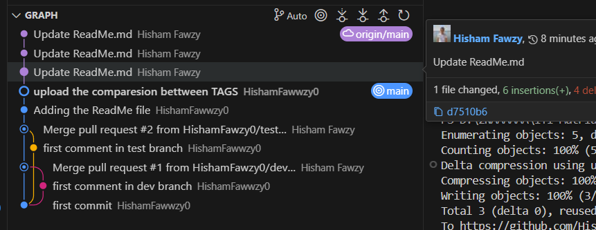

- How to delete a branch (Locally)

    git branch -D branch_name 

    EX: git branch -D dev


- How to delete a branch (Remotly)

    git push origin --delete branch_name

    EX: git push origin --delete dev


    -- comapare bettween Annotated Tag and lightweight Tag

    # Annotated Tag
    ## Includes a message about the commit
    ## Includes author & date information
    ## Stored as Git object

  
    # Lightweight Tag
    ## Does not include a commit message
    ## Does not include author & date information
    ## Does not store as Git object   Just a reference to the commit
    
    **Annotated Tag:**
```bash
git tag ## a v1.0.0 -m "First stable release"
```


**Lightweight Tag:**
```bash
git tag v1.0.0
```


# When to Use Rebase in Git

You use `rebase` in Git when you want to integrate changes from one branch into another in a linear fashion. It's typically used to:

1. **Maintain a cleaner project history**: Unlike `merge`, which creates a new commit that represents the merge, `rebase` rewrites the commit history by applying the changes from one branch on top of another.

2. **Avoid merge commits**: If you want to avoid extra merge commits that can clutter the history, `rebase` can be a good alternative. It makes it look like your work was based on the most recent commit.


# How to list Tags in Git

```bash
git tag
```

# How to delete a Tag (Locally)

```bash
git tag -d tag_name
```

# How to delete a Tag (Remotly)

```bash
git push origin :refs/tags/tag_name
```
# How to add image in readme.md
```bash


```



# how to crate a file and ignore it in .gitignore


